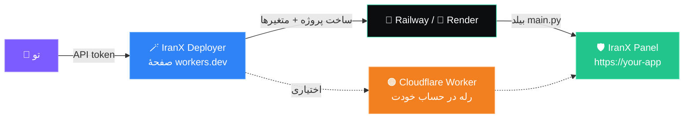
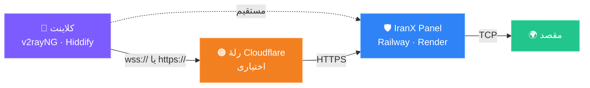

<div align="center">


<h3>⚡ پنل اشتراک VLESS در یک فایل، قابل اجرا روی هر جایی</h3>

<p>
مدیریت کاربر، حجم، محدودیت دستگاه و لینک سابسکریپشن — همه در <b>یک</b> فایل پایتون.<br/>
دو ترانسپورت · شش تم · رابط دوزبانه — <b>بدون هستهٔ Xray، بدون داکر، بدون VPS، بدون گواهی.</b>
</p>

<p>


</p>

<p>


</p>

<h3>
<a href="https://iranxpanel.cvtlwdm.workers.dev/">🚀 نصب‌کنندهٔ خودکار</a>
&nbsp;·&nbsp;
<a href="#-شروع-سریع">📦 شروع سریع</a>
&nbsp;·&nbsp;
<a href="README.md">🇬🇧 English</a>
</h3>

[English](README.md) · **فارسی**

</div>

---

<div dir="rtl" align="right">

## 🚀 بدون حتی یک خط دستور، نصب کن

</div>

<div align="center">

### <a href="https://iranxpanel.cvtlwdm.workers.dev/">🪄 IranX Deployer</a>

<a href="https://iranxpanel.cvtlwdm.workers.dev/">

</a>

<sub>https://iranxpanel.cvtlwdm.workers.dev/</sub>

</div>

<div dir="rtl" align="right">

این نصب‌کننده یک **صفحهٔ وب تک‌صفحه‌ای** است که همهٔ کار را خودش انجام می‌دهد: پروژه را روی
حساب هاستینگ خودت می‌سازد، تمام متغیرهای محیطی را تنزیم می‌کند، دامنه می‌گیرد و در انتها
آدرس پنل و رمز ورود را تحویلت می‌دهد. نه ترمینال، نه `git clone`، نه دستکاری YAML.

| قابلیت | توضیح |
|:--|:--|
| 🚄 **Railway یا Render** | سرویس‌دهنده را انتخاب کن، توکن API را پیست کن، شروع را بزن |
| 🏷️ **نام پروژه و ورک‌اسپیس** | ورک‌اسپیس‌ها و لوکیشن‌های سرور را از API خودش می‌خواند |
| 🔑 **رمز پنل** | رمز دلخواهت را بنویس یا خالی بگذار تا خودکار ساخته شود |
| ♻️ **جلوگیری از خواب (Render Free)** | هر ۱۰ دقیقه خودش را صدا می‌زند تا سرویس رایگان نخوابد |
| 🟠 **رلهٔ Cloudflare** | به دلخواه، یک Worker در حساب Cloudflare خودت می‌سازد و کانفیگ‌ها را به آن وصل می‌کند، نه به دامنهٔ هاست |
| 🔐 **امنیت توکن** | توکن فقط همان لحطه در حافظه استفاده می‌شود — ذخیره نمی‌شود، لاگ نمی‌شود |

</div>

<div align="center">



</div>

<div dir="rtl" align="right">

> [!IMPORTANT]
> **یک پیش‌نیاز برای Railway:** ریلوی برای خواندن هر ریپو — حتی پابلیک — لازم دارد حسابت به
> گیت‌هاب وصل باشد. یک بار برو **Account Settings → Integrations → GitHub** و وصلش کن.
> بعد از پایان نصب، توکن را از داشبورد حذف کن و یکی جدید بساز.

> [!TIP]
> **برای استفادهٔ جدی Railway را انتخاب کن.** پلن رایگان Render بعد از ۱۵ دقیقه بی‌کاری
> می‌خوابد و با بیدار شدن، دیتابیس `/tmp` پاک می‌شود و کاربرها و حجم‌ها از بین می‌روند.
> Railway نمی‌خوابد و دیسک پایدار قبول می‌کند.

---

## 💡 چرا این پروژه ساخته شد؟

بیشتر پنل‌ها یک VPS، یک دامنه، یک گواهی TLS و باینری Xray می‌خواهند. این یکی فقط یک
**حساب رایگان PaaS** می‌خواهد. پلتفرم خودش TLS را خاتمه می‌دهد، پس `main.py` اینباندهای
VLESS را در پایتون خالص پیاده کرده و ترافیک TCP را رله می‌کند — چیزی برای نصب نیست، چیزی برای
تمدید کردن نیست.

</div>

<div align="center">



</div>

<div dir="rtl" align="right">

TLS در لبهٔ پلتفرم خاتمه می‌شود، پس `main.py` همیشه VLESS را روی یک استریم ازپیش‌رمزشده
صحبت می‌کند. رله اختیاری است — وقتی لازم می‌شود که دامنهٔ خود هاست از شبکهٔ تو قابل
دسترس نباشد.

---

## ✨ قابلیت‌ها

</div>

<table dir="rtl">
<tr>
<td width="50%" valign="top" align="right">

### 🔐 دسترسی و امنیت
- ورود فقط با رمز — نام کاربری همیشه `admin`
- رمز را در **اولین بازدید** خودت انتخاب می‌کنی
- PBKDF2-SHA256 با ۲۰۰٬۰۰۰ دور
- ورود نرخ‌محدود، کوکی نشست JWT
- لاگ رویداد: ورود، رد اتصال، تغییر UUID

</td>
<td width="50%" valign="top" align="right">

### 👥 کاربران
- ساخت، ویرایش، فعال/غیرفعال، حذف
- سقف حجم برای هر کاربر (`0` = بی‌نهایت)
- انقضا بر اساس روز
- محدودیت دستگاه بر اساس **آی‌پی‌های فعال متمایز**
- تغییر UUID برای سوزاندن کانفیگ لو رفته

</td>
</tr>
<tr>
<td width="50%" valign="top" align="right">

### 🔀 ترانسپورت‌ها
- `VLESS + WS + TLS`
- `VLESS + XHTTP + TLS` *(packet-up)*
- برای هر کاربر جدا: یکی، اون یکی، یا هر دو
- ترانسپورت اشتباه برای کاربر رد می‌شود

</td>
<td width="50%" valign="top" align="right">

### 🎨 رابط کاربری
- منوی کشویی با پنج بخش
- **شش تم**، در هر مرورگر ذخیره می‌شود
- دوزبانه فارسی / انگلیسی با پشتیبانی RTL
- نمودار ترافیک ۲۴ ساعته و تفکیک ترانسپورت
- کد QR برای هر سابسکریپشن

</td>
</tr>
</table>

---

<div dir="rtl" align="right">

## 🖼️ تصاویر پنل

</div>

<div align="center">

<!-- تصاویر را با همین نام‌ها در پوشهٔ docs/ بگذار تا گالری خودش پر شود -->

| 📊 داشبورد | 👥 کاربران |
|:--:|:--:|
|  |  |

| 🧊 آی‌پی تمیز | 🎨 تم‌ها |
|:--:|:--:|
|  |  |

<sub>شش تم روشن و تاریک، فارسی و انگلیسی با پشتیبانی کامل راست‌به‌چپ</sub>

</div>

---

<div dir="rtl" align="right">

## 📦 شروع سریع

<details open>
<summary><b>🪄 روش الف — نصب‌کنندهٔ خودکار (پیشنهادی)</b></summary>

<br/>

1. صفحهٔ **[IranX Deployer](https://iranxpanel.cvtlwdm.workers.dev/)** را باز کن
2. **Railway** یا **Render** را انتخاب کن
3. توکن API را پیست کن، نام پروژه بگذار، ورک‌اسپیس و لوکیشن را بارگیری کن
4. اگر خواستی رمز پنل بده، جلوگیری از خواب را فعال کن، یا رلهٔ Cloudflare بیافزا
5. **شروع نصب** را بزن — در انتها آدرس پنل و رمز ورود را می‌گیری

</details>

<details>
<summary><b>🚄 روش ب — نصب دستی روی Railway</b></summary>

<br/>

**۱.** این ریپو را فورک کن یا فایل‌ها را در ریپوی خودت آپلود کن.

**۲.** [railway.app](https://railway.app) ← **New Project** ← **Deploy from GitHub repo** ← ریپو را انتخاب کن.

**۳.** تب **Variables** را باز کن:

| متغیر | نمونه | |
|---|---|---|
| `SECRET_KEY` | یک رشتهٔ تصادفی بلند | **الزامی** |
| `DOMAIN` | `myapp.up.railway.app` | **الزامی** |
| `WS_PATH` | `ws` | اختیاری |
| `XHTTP_PATH` | `xh` | اختیاری |
| `DEVICE_WINDOW` | `300` | اختیاری |
| `SESSION_IDLE` | `90` | اختیاری |
| `DB_PATH` | `/tmp/panel.db` | اختیاری |
| `ADMIN_PASSWORD` | — | اختیاری، صفحهٔ نصب را رد می‌کند |

**۴.** از **Settings → Networking → Generate Domain** دامنه بگیر، در `DOMAIN` بگذار و ریدیپلوی کن.

**۵.** آدرس `https://your-domain/` را باز کن — صفحهٔ نصب می‌آید، رمز را انتخاب کن. تمام.

> [!TIP]
> در پلن Trial ممکن است اولین بیلد تا ده دقیقه در وضعیت `QUEUED` بماند. این طبیعی
> است — صبر کن و فکر نکن خراب شده.

</details>

<details>
<summary><b>🎨 روش پ — Render</b></summary>

<br/>

Render فایل `render.yaml` را خودکار می‌خواند. یک **Web Service** بساز، ریپو را وصل کن، سپس
`SECRET_KEY` و `DOMAIN` را در بخش Environment اضافه کن.

</details>

<details>
<summary><b>🐍 روش ت — هر هاست ASGI دیگر</b></summary>

<br/>

```bash
pip install -r requirements.txt
gunicorn -k uvicorn.workers.UvicornWorker main:app --bind 0.0.0.0:$PORT --timeout 0
```

هر محیطی که TLS را خاتمه دهد و WebSocket upgrade را عبور دهد کار می‌کند.

</details>

---

## 🧭 بخش‌های پنل

| بخش | محتوا |
|:--|:--|
| 📊 **داشبورد** | مجموع مصرف، نمودار ۲۴ ساعته، تفکیک WS/XHTTP، تعداد نشست زندهٔ XHTTP |
| 👥 **کاربران** | ساخت، فهرست، ویرایش، کانفیگ و لیست آی‌پی هر کاربر |
| 🧊 **آی‌پی تمیز** | افزودن تکی و گروهی، فعال/غیرفعال، حذف |
| ⚙️ **تنزیمات پنل** | تم، زبان، تغییر رمز، اطلاعات سرور |
| 📝 **رویدادها** | تلاش‌های ورود، اتصال‌های ردشده، تغییر UUID |

---

## 🔀 ترانسپورت‌ها

هر کاربر روی یک حالت تنزیم می‌شود:

| حالت | چه چیزی در سابسکریپشنش می‌آید |
|:--|:--|
| `WS + TLS` | فقط کانفیگ‌های `type=ws` |
| `XHTTP + TLS` | فقط کانفیگ‌های `type=xhttp` با `mode=packet-up` |
| **هر دو** | هر دو نوع، به‌علاوه یکی از هر کدام برای هر آی‌پی تمیز |

```
WebSocket   wss://<domain>/<WS_PATH>          پیش‌فرض /ws
XHTTP       https://<domain>/<XHTTP_PATH>/…   پیش‌فرض /xh
```

این دو مسیر باید متفاوت باشند.

> [!WARNING]
> **XHTTP آزمایشی است.** به شکل `packet-up` پیاده شده: برای مسیر ارسال، درخواست‌های
> `POST` شماره‌دار و برای دریافت، یک `GET` استریمی با بافر مرتب‌سازی قطعات. اگر هر پروکسی
> یا CDN در مسیر، پاسخ‌ها را بافر کند، مسیر دریافت قفل می‌شود. **WS مسیر قابل‌اعتماد
> است** — اگر کاربری مشکل داشت، روی WS بگذارش.

---

## 🧊 آی‌پی تمیز

آدرس‌های تمیز را یک بار اضافه کن؛ به سابسکریپشن **همهٔ** کاربران به‌عنوان کانفیگ اضافه
الافزوده می‌شوند. آدرس اتصال به آی‌پی تمیز تغییر می‌کند ولی `sni` و `host` روی دامنهٔ واقعی
خودت می‌مانند.

ورودی گروهی، هر خط یک مورد؛ برچسب بعد از `#`:

```
104.16.132.229  # Irancell
172.67.72.14    # MCI
cdn.example.com # Backup
188.114.97.3
```

با دکمهٔ ⏸ می‌توانی یک آدرس را بدون حذف، غیرفعال کنی.

---

## 📬 خروجی سابسکریپشن

اولین مورد یک **کانفیگ اطلاع‌رسان** است — غیرفعال است و فقط برای این وجود دارد که کلاینت،
وضعیت حساب را بالای لیست نشان دهد:

```
📊 ali_home | 20.50GB | 22Days
🌐 ali_home · WS · Default
⚡ ali_home · Irancell · WS
🌐 ali_home · XHTTP · Default
⚡ ali_home · Irancell · XHTTP
```

این کانفیگ به پورت ۸۰ با `security=none` و روی مسیری اشاره می‌کند که هر دو اینباند نادیده
می‌گیرند، پس هرگز اتصال برقرار نمی‌کند. هدر `subscription-userinfo` هم فرستاده می‌شود، پس
Hiddify و Streisand حجم و انقضا را در رابط خودشان نشان می‌دهند.

---

## 🔄 سوزاندن کانفیگ لو رفته

از مسیر **کاربران → ویرایش**:

- 🎲 **UUID جدید** — یک UUID تصادفی تازه و پاک شدن لیست آی‌پی
- ✍️ **UUID دلخواه** — هر UUID که خودت بخواهی

کانفیگ‌های قبلی بلافاصله از کار می‌افتند. لینک سابسکریپشن تغییر نمی‌کند، پس کاربر فقط
باید سابسکریپشنش را رفرش کند.

---

## 📱 محدودیت دستگاه چطور کار می‌کند

هر آی‌پی مبدأ به همراه پروتکلش ثبت می‌شود و تا `DEVICE_WINDOW` ثانیه پس از آخرین اتصال،
یک دستگاه فعال شمرده می‌شود. وقتی سقف پر شد، آی‌پی جدید رد می‌شود. دکمهٔ **IPs** لیست
دقیق را با وضعیت آنلاین و پروتکل هر دستگاه نشان می‌دهد.

> [!NOTE]
> چند دستگاه پشت یک مودم خانگی، یک آی‌پی مشترک دارند و یک دستگاه شمرده می‌شوند.
> این طبیعت شمارش بر اساس آی‌پی است، باگ نیست.

---

## 🗂️ ساختار ریپو

```
main.py             هسته — FastAPI، هر دو اینباند، رابط توکار
requirements.txt    وابستگی‌های قفل‌شده
Procfile            دستور اجرا برای Railway / Render / Heroku
railway.json        تنزیمات دیپلوی Railway
render.yaml         بلوپرینت Render
panel-config.toml   مرجع متغیرهای محیطی
```

---

## ℹ️ خوب است بدانی

- 💾 **دیتابیس روی `/tmp` موقت است** و با هر ریدیپلوی پاک می‌شود. برای پایداری، یک ولوم
  وصل کن و `DB_PATH=/data/panel.db` بگذار.
- 🚫 **UDP پشتیبانی نمی‌شود** — فقط TCP. در کلاینت، DNS را روی DoH بگذار.
- ⬆️ ارتقا از نسخهٔ قدیمی بی‌خطر است: ستون‌های جدید خودکار با `ALTER TABLE` اضافه می‌شوند.
- 💳 هاست، ترافیک مصرفی کاربرانت را از تو حساب می‌کند؛ حواست به داشبورد صورت‌حساب باشد.
- 📚 برای استفادهٔ شخصی و آموزشی ساخته شده است.
- ⚠️ پلن رایگان Workers روزی ۱۰۰٬۰۰۰ درخواست دارد و پروکسی کردن ترافیک عمومی با Workers
  خلاف شرایط Cloudflare است — مسئولانه استفاده کن.

</div>

---

<div align="center">

### ⭐ اگر جلوی خرید یک VPS را گرفت، یک ستاره بده

<a href="https://iranxpanel.cvtlwdm.workers.dev/">

</a>

**MIT** · ایشو و پول‌رکوست خوش‌آمد است


</div>
