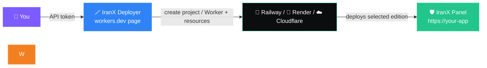
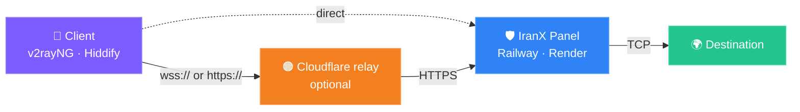

<div align="center">


<h3>⚡ IranX Panel — VLESS panel for Python hosts and Cloudflare Workers</h3>

<p>
Manage users, quotas, device limits and subscription links from the original Python panel on Railway/Render,
or deploy the native Cloudflare Workers + D1 edition.
</p>

<p>


</p>

<p>


</p>

<h3>
<a href="https://iranxpanel.cvtlwdm.workers.dev/">🚀 One-Click Auto Deployer</a>
&nbsp;·&nbsp;
<a href="#-quick-start">📦 Quick start</a>
&nbsp;·&nbsp;
<a href="README-fa.md">🇮🇷 فارسی</a>
</h3>

**English** · [فارسی](README-fa.md)

</div>

---

## 🚀 Install it without touching a terminal

<div align="center">

### <a href="https://iranxpanel.cvtlwdm.workers.dev/">🪄 IranX Deployer</a>

<a href="https://iranxpanel.cvtlwdm.workers.dev/">

</a>

<sub>https://iranxpanel.cvtlwdm.workers.dev/</sub>

</div>

The deployer is a **single web page** that builds the whole thing for you: it creates the
project on your hosting account, sets every environment variable, generates the domain,
and hands you back a working panel URL and password. No CLI, no `git clone`, no YAML.

| What it does | Detail |
|:--|:--|
| 🚄 **Railway or Render** | Pick your provider, paste an API token, press start |
| 🏷️ **Project name & workspace** | Loads your workspaces and server locations from the API |
| 🔑 **Panel password** | Type your own, or leave it blank for a generated one |
| ♻️ **Anti-sleep (Render Free)** | Pings itself every 10 minutes so the free service never sleeps |
| ☁️ **Cloudflare Workers + D1** | Creates a native panel Worker, D1 database, schema, secrets, bindings and workers.dev address directly in the user's account |
| 🔐 **Token hygiene** | The token is used in-memory for that single request — never stored, never logged |

<div align="center">



</div>

> [!IMPORTANT]
> **One prerequisite for Railway:** Railway must be allowed to read a GitHub repo — even a
> public one. Go to **Account Settings → Integrations → GitHub** once and connect it.
> After the install finishes, delete the API token from your dashboard and create a fresh one.

> [!TIP]
> **Railway for anything serious.** Render's free plan sleeps after 15 minutes and wipes the
> `/tmp` database when it wakes — users and quotas disappear. Railway does not sleep and
> accepts a persistent disk.

---

## 💡 Why this exists

Most panels want a VPS, a domain, a certificate and an Xray binary. This one wants a
**free PaaS account**. The platform terminates TLS for you, so `main.py` implements the
VLESS inbounds in pure Python and relays TCP — nothing to install, nothing to renew.

<div align="center">



</div>

TLS terminates at the platform's edge, so `main.py` only ever speaks plain VLESS over an
already-encrypted stream. The relay is optional — add it when the host's own domain is
unreachable from your network.

---

## ✨ Features

<table>
<tr>
<td width="50%" valign="top">

### 🔐 Access & security
- Password-only login — username is always `admin`
- You choose the password on **first visit**
- PBKDF2-SHA256, 200 000 rounds
- Rate-limited login, JWT session cookie
- Event log: logins, rejections, UUID rotations

</td>
<td width="50%" valign="top">

### 👥 Users
- Create, edit, enable/disable, delete
- GB quota per user (`0` = unlimited)
- Expiry in days
- Device limit from **distinct active IPs**
- UUID rotation to kill a leaked config

</td>
</tr>
<tr>
<td width="50%" valign="top">

### 🔀 Transports
- `VLESS + WS + TLS`
- `VLESS + XHTTP + TLS` *(stream-up by default, packet-up available)*
- Chosen per user: one, the other, or both
- Wrong transport for a user is refused

</td>
<td width="50%" valign="top">

### 🎨 Interface
- Hamburger drawer, five sections
- **Six themes**, remembered per browser
- Bilingual FA / EN, RTL aware
- 24-hour traffic chart, transport split
- QR code for every subscription

</td>
</tr>
</table>

---

## 📦 Quick start

<details open>
<summary><b>🪄 Option A — IranX Deployer (recommended)</b></summary>

<br/>

1. Open **[IranX Deployer](https://iranxpanel.cvtlwdm.workers.dev/)**
2. Choose **Railway**, **Render**, or **Cloudflare Workers + D1**
3. Paste your provider API token, choose the account/project fields, and load the available resources
4. Optionally provide a panel password (or let the deployer generate one)
5. Press **Start** — you get the panel URL and login password at the end

For Cloudflare, the deployer creates a native panel Worker, D1 database, schema, bindings, secrets, environment variables, and the `workers.dev` address in the selected account.

</details>

<details>
<summary><b>🚄 Option B — Railway by hand</b></summary>

<br/>

**1.** Fork this repository, or upload these files to a repo of your own.

**2.** [railway.app](https://railway.app) → **New Project** → **Deploy from GitHub repo** → pick it.

**3.** Open the **Variables** tab:

| Variable | Example | |
|---|---|---|
| `SECRET_KEY` | a long random string | **required** |
| `DOMAIN` | `myapp.up.railway.app` | **required** |
| `WS_PATH` | `ws` | optional |
| `XHTTP_PATH` | `xh` | optional |
| `XHTTP_MODE` | `stream-up` | optional, `stream-up` or `packet-up` |
| `DEVICE_WINDOW` | `300` | optional |
| `SESSION_IDLE` | `90` | optional |
| `DB_PATH` | `/tmp/panel.db` | optional |
| `ADMIN_PASSWORD` | — | optional, skips the setup page |

**4.** **Settings → Networking → Generate Domain**, put that value in `DOMAIN`, redeploy.

**5.** Open `https://your-domain/` — the setup page appears. Choose a password. Done.

> [!TIP]
> On a Trial plan the first build can sit in `QUEUED` for ten minutes before it even
> starts. That is normal — wait it out before assuming something broke.

</details>

<details open>
<summary><b>☁️ Option C — Cloudflare Workers + D1</b></summary>

<br/>

Cloudflare is a first-class deployment target, not only an optional relay. Select **Cloudflare** in the deployer and provide an account token with these restricted permissions:

- Workers Scripts: Edit
- D1: Edit
- Account Settings: Read

The deployer creates a native JavaScript panel Worker, D1 database, schema, `DB` binding, panel secrets, `DOMAIN`/`RELAY_DOMAIN` variables, and the `workers.dev` address. The **Create token in Cloudflare** button opens Cloudflare's official token form with the required Workers Scripts and D1 permissions pre-filled. Choose a custom password or leave it blank to generate one. The token is not persisted or logged and should be revoked after installation.

For a manual Dashboard deployment and detailed configuration, see [`cloudflare/README-fa.md`](cloudflare/README-fa.md).

</details>

<details>
<summary><b>🎨 Option D — Render</b></summary>

<br/>

Render reads `render.yaml` automatically. Create a **Web Service**, connect the repo,
then add `SECRET_KEY` and `DOMAIN` under Environment.

</details>

<details>
<summary><b>🐍 Option E — Any other ASGI host</b></summary>

<br/>

```bash
pip install -r requirements.txt
gunicorn -k uvicorn.workers.UvicornWorker main:app --bind 0.0.0.0:$PORT --timeout 0
```

Anything that terminates TLS and forwards WebSocket upgrades will work.

</details>

---

## 🧭 The panel

| Section | What's in it |
|:--|:--|
| 📊 **Dashboard** | Totals, 24-hour chart, WS/XHTTP split, live XHTTP session count |
| 👥 **Users** | Create, list, edit, per-user configs and IP list |
| 🧊 **Clean IP** | Single and bulk add, enable/disable, delete |
| ⚙️ **Panel settings** | Theme, language, change password, server info |
| 📝 **Events** | Login attempts, refused connections, UUID rotations |

---

## 🔀 Transports

Each user is set to one mode:

| Mode | What lands in their subscription |
|:--|:--|
| `WS + TLS` | only `type=ws` configs |
| `XHTTP + TLS` | only `type=xhttp` configs, at the mode `XHTTP_MODE` selects |
| **Both** | both kinds, plus one of each per Clean IP |

```
WebSocket   wss://<domain>/<WS_PATH>          default /ws
XHTTP       https://<domain>/<XHTTP_PATH>/…   default /xh
```

The two paths must differ.

### Request cost — this matters behind a Cloudflare relay

A Worker in front of the panel is billed per request, and the transports differ wildly:

| Route | Requests per connection |
|---|---|
| `ws` | **1**, for the whole life of the tunnel however long it lasts |
| `xhttp` `mode=stream-up` | **2** — one streamed `GET` down, one long-lived `POST` up |
| `xhttp` `mode=packet-up` | **1 + one per uploaded chunk** — hundreds a minute per active client |

`XHTTP_MODE` picks what generated configs advertise and defaults to `stream-up`. The
server accepts **both** uplink shapes no matter how it is set, so links already handed
out keep working after an upgrade; users only need to refresh their subscription to move
onto the cheaper mode. The active mode is shown under **Panel settings → Server info**.

> [!WARNING]
> **XHTTP is experimental.** `stream-up` keeps the uplink on one request whose body is
> read incrementally; `packet-up` uses numbered `POST`s with a reorder buffer. Either way
> the downlink is a streamed `GET`, so if any proxy or CDN in the path buffers responses
> the downlink stalls. `stream-up` additionally needs the path not to buffer *request*
> bodies. **WS is the reliable route** — if a user has trouble, switch them to WS.

---

## 📦 Backup & restore

**Panel settings → Backup** downloads one `.ixpbak` file (JSON) holding every user with
their **UUID and subscription token**, all clean IPs with their remarks and enabled flags,
the panel password hash, and the environment the panel was running under. Two toggles let
you exclude the password or include traffic history.

**Panel settings → Restore** takes that file back. Picking a file only *previews* it —
counts, creation date, and any environment variables that differ from the current host —
and writes nothing until you confirm. Two modes:

| Mode | Effect |
|---|---|
| Merge | users matching by name or UUID are updated, the rest are added |
| Replace | current users and clean IPs are wiped first |

Because UUIDs and subscription tokens are preserved, **configs already installed on your
users' devices keep working** after a migration — they only need the new host's paths if
`WS_PATH`/`XHTTP_PATH` changed, which the preview points out.

The file carries a SHA-256 checksum over its payload; a truncated or hand-edited file is
refused unless you restore with `force`. Every restore runs in a single transaction, so a
failure leaves the database untouched. Malformed rows are skipped and counted rather than
aborting the whole import.

Environment variables (`DOMAIN`, `WS_PATH`, `XHTTP_PATH`, `XHTTP_MODE`, `RELAY_DOMAIN`, …)
are recorded for reference only — a panel cannot rewrite its own platform variables, so set
those by hand on the new host.

API: `GET /api/backup?password=1&traffic=0`, `GET /api/backup/info`,
`POST /api/restore/preview`, `POST /api/restore`.

---

## 🧊 Clean IP

Add clean addresses once; they are appended to **every** user's subscription as extra
configs. The connection address becomes the clean IP while `sni` and `host` stay on your
real domain.

Bulk input takes one entry per line, label after `#`:

```
104.16.132.229  # Irancell
172.67.72.14    # MCI
cdn.example.com # Backup
188.114.97.3
```

Use ⏸ to disable an address without deleting it.

---

## 📬 Subscription output

The first entry is an **info config** — non-functional, present only so the client
displays the account state at the top of the list:

```
📊 ali_home | 20.50GB | 22Days
🌐 ali_home · WS · Default
⚡ ali_home · Irancell · WS
🌐 ali_home · XHTTP · Default
⚡ ali_home · Irancell · XHTTP
```

It points at port 80 with `security=none` on a path both inbounds ignore, so it can never
be dialled. The `subscription-userinfo` header is also set, so Hiddify and Streisand show
quota and expiry in their own UI as well.

---

## 🔄 Killing a leaked config

**Users → Edit:**

- 🎲 **New UUID** — fresh random UUID, and the IP list is cleared
- ✍️ **Custom UUID** — any UUID you choose

Old configs stop working immediately. The subscription link is unchanged, so the user only
needs to refresh their subscription.

---

## 📱 How the device limit works

Every source IP is recorded with its protocol and counts as an active device for
`DEVICE_WINDOW` seconds after its last connection. Once the limit is reached, a new IP is
refused. The **IPs** button shows the exact list with online state and protocol per device.

> [!NOTE]
> Several devices behind one home router share a single IP and count as one device. That
> is inherent to IP-based counting, not a bug.

---

## 🗂️ Repository

```
main.py             core — FastAPI, both inbounds, embedded UI
requirements.txt    pinned dependencies
Procfile            start command for Railway / Render / Heroku
railway.json        Railway deploy config
render.yaml         Render blueprint
panel-config.toml   environment variable reference
```

---

## ℹ️ Good to know

- 💾 **The database on `/tmp` is ephemeral** and wiped on every redeploy. For persistence,
  attach a volume and set `DB_PATH=/data/panel.db`.
- 🚫 **UDP is not supported** — TCP only. Set DNS to DoH in your client.
- ⬆️ Upgrading from an older version is safe: new columns are added automatically via
  `ALTER TABLE`.
- 💳 Your host bills you for the bandwidth your users consume. Watch the billing dashboard.
- 📚 Built for personal and educational use.
- ⚠️ Cloudflare's free Workers plan allows 100 000 requests/day, and proxying general
  traffic through Workers is against Cloudflare's terms — use the relay responsibly.

---

<div align="center">

### ⭐ If this saved you a VPS bill, drop a star

<a href="https://iranxpanel.cvtlwdm.workers.dev/">

</a>

**MIT** · issues and pull requests welcome


</div>
